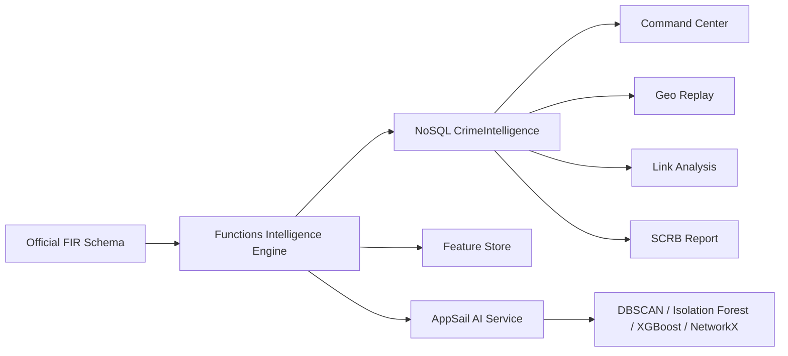
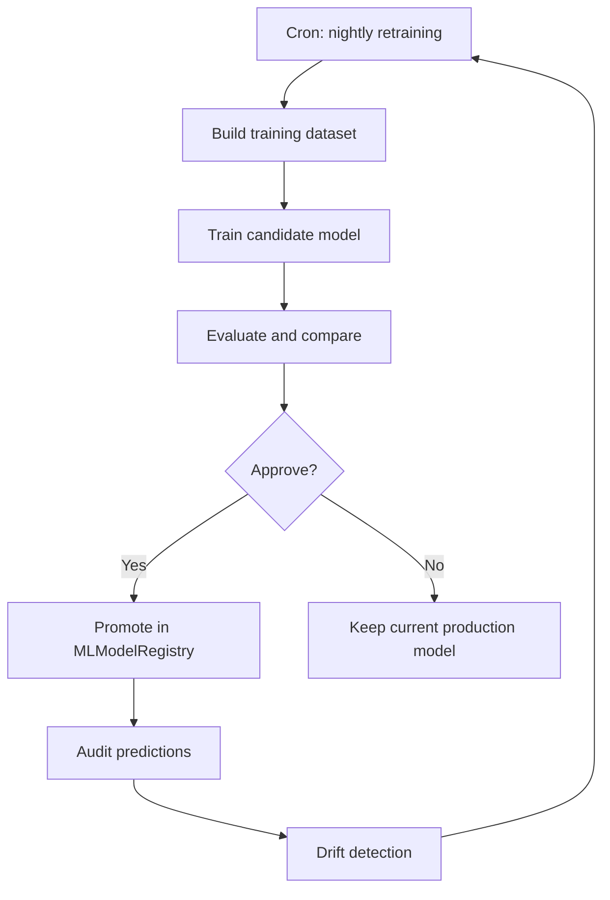
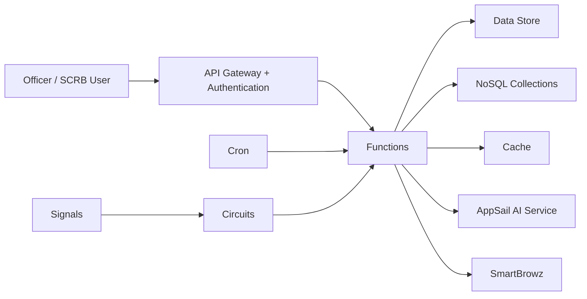

# CIAP Architecture Diagrams

## Intelligence Flow

```mermaid
flowchart LR
  A[Official FIR Schema] --> B[Functions Intelligence Engine]
  B --> C[NoSQL CrimeIntelligence]
  B --> D[Feature Store]
  B --> E[AppSail AI Service]
  E --> F[DBSCAN / Isolation Forest / XGBoost / NetworkX]
  C --> G[Command Center]
  C --> H[Geo Replay]
  C --> I[Link Analysis]
  C --> J[SCRB Report]
```

## ML Lifecycle

```mermaid
flowchart TD
  A[Cron: nightly retraining] --> B[Build training dataset]
  B --> C[Train candidate model]
  C --> D[Evaluate and compare]
  D --> E{Approve?}
  E -->|Yes| F[Promote in MLModelRegistry]
  E -->|No| G[Keep current production model]
  F --> H[Audit predictions]
  H --> I[Drift detection]
  I --> A
```

## Catalyst Deployment

```mermaid
flowchart LR
  U[Officer / SCRB User] --> APIG[API Gateway + Authentication]
  APIG --> FN[Functions]
  FN --> DS[Data Store]
  FN --> NS[NoSQL Collections]
  FN --> CA[Cache]
  FN --> AS[AppSail AI Service]
  FN --> SB[SmartBrowz]
  CR[Cron] --> FN
  SI[Signals] --> CI[Circuits] --> FN
```
